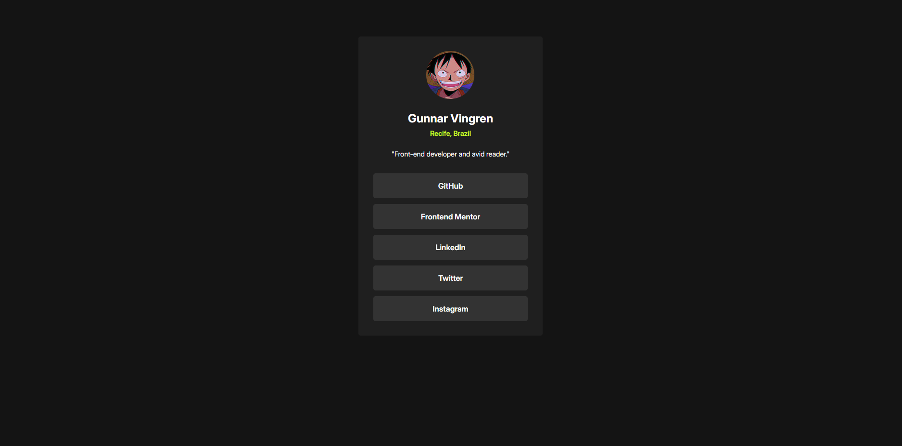

# SOCIAL LINKS PROFILE 🌐📱📸

Welcome to the SOCIAL LINKS PROFILE Challenge! This repository contains a solution for the Frontend Mentor challenge, where I built a page with my social links using only HTML and CSS. The project demonstrates responsiveness and the application of various design concepts.

## Project Structure 📂

- **`assets/`**: Contains all static assets for the project.

  - **`images/`**: Houses the favicon and the main banner image used in the HTML document.
  - **`fonts/`**: Contains files needed to import the Outfit and Young-Serif fonts locally.

- **`design/`**: Holds preview images of the mobile and desktop layouts, which served as references during development.

- **`index.html`**: The main HTML file for the recipe page.

- **`style-guide.md`**: Provides the style guides and design principles used to aid in the coding process.

## Technologies Used 🛠️

- **HTML**: For structuring the content of the recipe page.
- **CSS**: For styling and ensuring the page's responsiveness.
- **Grid Layout**: For position elements on the screen in a clean and organized way

## Preview 👀

## Getting Started 🚀

To view the project, open `index.html` in your web browser. For more details on the design and styling approach, check out the `style-guide.md` file.

## Acknowledgments 🙏

- Thank you to Frontend Mentor for the challenge and design inspiration.
- Special thanks to John 3:16 for reminding us of the ultimate act of love and sacrifice, which inspires and motivates us to create with purpose.

Feel free to explore the project and provide feedback or suggestions!

---

**Note:** The main branch of this repository contains all the code and assets for the project.
